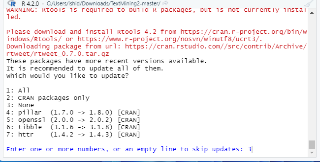

# 石田基広『実践 Rによるテキストマイニング』森北出版 スクリプト vers.1.0

以下、Windows 版 R-4.2 への対応と、rtweet バージョン 1.0 に関する注意事項を記します（2022年8月現在）。

## Windows 版R 4.2 への対応について

Windows 版 R バージョン 4.2 から、デフォルトの文字コードが UTF-8 となり、またインストールされるのが 64 Bit のみとなりました。
本書の重版(2022年8月)では対応済みですが、基本、以下が必要となります。
 
### Windows版MeCab のインストールについて

Windows版Rをご利用の場合、Rのバージョンによって、それぞれ異なるインストーラーをダウンロードしてインストールしてください。

#### Windows版R-4.1 まで

工藤拓氏の公式サイト <https://taku910.github.io/mecab/> からインストーラーをダウンロードして、文字コードは標準のShift-JISのままインストールしてください。

またここに登録されているファイルはすべて文字コードが UTF-8 になっています。このため Windows 版 RStudio で開くと、日本語部分が文字化けします。これを修正するには、RStudio のメニューから、File -> Reopen with Encoding -> UTF-8 として開き直します。画面上で文字化けが修正されたことが確認できたら、再び RStudio のメニューから Save with Encoding を指定し CP932 で保存し直してください。


#### Windows版R-4.2 以降

ikegami氏の Github サイト <https://github.com/ikegami-yukino/mecab/releases> から私家版MeCabインストーラーをダウンロードし、文字コードはUTF-8を指定してインストールしてください。

このサイト(https://github.com/IshidaMotohiro/textMining)に登録されているファイルはすべて文字コードが UTF-8 になっていますが、このファイルをそのまま使ってください。Shift-JISに変換する必要はありません。


## macOS での MeCab インストールについて

macOS では、現在、CPUにIntel版とM1(Sillicon)版の2つがあり、MeCab をインストールする場合に注意が必要です。

左上のAppleアイコンをクリックし、「このMacについて」を選びます。ここで、自身が使っている MacOS マシンが Intel 版なのか M1 版なのか、確認しておいてください。
なおMeCabをインストールするには、Apple 社が無償で公開している Xcode コマンドラインツールが必要です（Xcode本体は不要です）。コマンドラインツールのインストールは、アプリケーションフォルダのユーティリティーフォルダにあるターミナルを起動し、以下の命令を入力してEnterキーを押します。

```
xcode-select --install
```

ポップアップメッセージに従ってインストールを完了してください。

### Intel 版 macOS

工藤拓氏のサイトから MeCab 本体のソース mecab-0.996.tar.gz と、辞書 mecab-ipadic-2.7.0-20070801.tar.gz をダウンロードし、同サイトの指示通りにビルドしてください。


### M1 (Sillicon) 版 macOS

ターミナルのプロパティを確認します。ターミナルのアイコン上で Ctrl キーを押しながらクリックします。サブメニューが表示されるので、「情報をみる」を選びます。

ここで「Rosettaを使用して開く」にチェックが入っていないかどうかを確認してください。MeCabをビルドする際にターミナルを使いますが 「Rosetta を使う」にチェックが入っていると、M1 用ではなく Intel 用の MeCab が作成されてしまいます。
（ややっこしいのですが、M1 MacOS に Intel 用の MeCab をビルドすることができます。ユーザーが意識しないところで Rosetta というソフトウェアが M1 アーキテクチャと Intel アーキテクチャの橋渡しを行います。）

ユーザーが気が付かないうちにターミナルが Rosetta を利用している場合があります。これを確認するため、ターミナルの「情報をみる」で「Rossetaを使用して開く」を確認するわけです。チェックが入っている場合はチェックを外し、ターミナルをいったん閉じて、起動し直します。

なお M1 版 macOS で MeCab をビルドする手順を YouTube で公開しています。動画では Python から MeCab を利用する前提で説明していますが、MeCab のビルドとインストール手順については、Python も R も全く同じです。

https://youtu.be/0ePI8a9kNUI

[](https://www.youtube.com/watch?v=0ePI8a9kNUI)


## rtweet について

本書記載の内容を確認するにはアーカイブのバージョン0.7.0を利用してください。

```
install.packages("devtools")
devtools::install_version("rtweet", version = "0.7.0", repos = "http://cran.us.r-project.org")
```



この場合、Twitter API のトークンを取得する必要はありません。rtweetの関数を実行すると、自動的にブラウザが起動し、Twitter アカウントの認証が求められます。スクリプト(Chapter4.R)を参照してください。


## 本書のデータ分析を Python で実施する方法

『Pythonで学ぶテキストマイニング』
    出版社  :  シーアンドアール研究所 (2022/8/13)
    発売日  :  2022/8/13
    ISBN-13  :  978-4863543935 https://www.amazon.co.jp/dp/486354393X/
